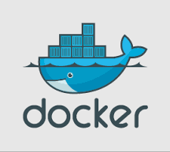

# docker
Docker and tomcat 8 in a few simple steps

## Overview

The process flow of getting a docker container up and running Tomcat 8 with a hello world application.



## Prerequisites

1. Build a hello world war file, use the git repo 
   https://github.com/efsavage/hello-world-war
   
2. Install docker
   https://docs.docker.com/engine/installation/linux/ubuntulinux/


## Steps

1. Build a docker image
2. Check the image
3. Run a docker container from the image
4. List the container
5. Attach to the running docker container to inspect details
6. Shutdown the container


### Build a docker image

   Create a directory called "docker" and copy the "hello world" war file and the "Dockerfile" in this directory.

   On listing the contents of the directory "docker"
   
   ```shell
   
   root@ubuntu:~# ls docker
   Dockerfile  hello-world.war
   
   ```

   To build the image using the Dockerfile run the below command.

   Change the tag "thinktag/tomcat" to something else.   
  
   ```shell
   
   docker build -t 'thinktag/tomcat' docker/
   
   ```
     
     
   
### Check the images
   
   Run the below command to list the images
   
   ```shell
   
   root@ubuntu:~# docker images
   REPOSITORY          TAG                 IMAGE ID            CREATED             SIZE
   thinktag            tomcat              ac8bcb99503a        22 minutes ago      779.8 MB
   ubuntu              14.04               b2f1fdd93175        3 days ago          188.4 MB
   
   ```
   
   
### Run a docker container from the image.

   To run a docker container using the created images
 
   ```shell
   
   docker run -d -p 8080:8080 -p 8009:8009 thinktag:tomcat
   
   ```
	
### List the containers.	
	
	To list the running containers
	
	```shell
   
	root@ubuntu:~# docker ps
	CONTAINER ID        IMAGE               COMMAND                  CREATED             STATUS              PORTS                                            NAMES
	164e21a62c99        thinktag:tomcat     "/opt/tomcat/bin/cata"   25 minutes ago      Up 25 minutes       0.0.0.0:8009->8009/tcp, 0.0.0.0:8080->8080/tcp   gigantic_bhaskara
	
	```
	
### Attach to the running docker container to inspect details

	You can attach to a running container for debugging

	```shell
   
    root@ubuntu:~# docker exec -it 164e21a62c99 /bin/bash
    root@164e21a62c99:/opt/tomcat#
    
	```
   
### Shutdown the container
    
	You can shutdown the container by shutting down tomcat.

    ```shell
   
    root@ubuntu:~# docker exec -it 164e21a62c99 /bin/bash
    root@164e21a62c99:/opt/tomcat# bin/shutdown.sh
	
    ```

## References
   https://github.com/cmoro-deusto/docker-tomcat8/blob/master/Dockerfile
   
	